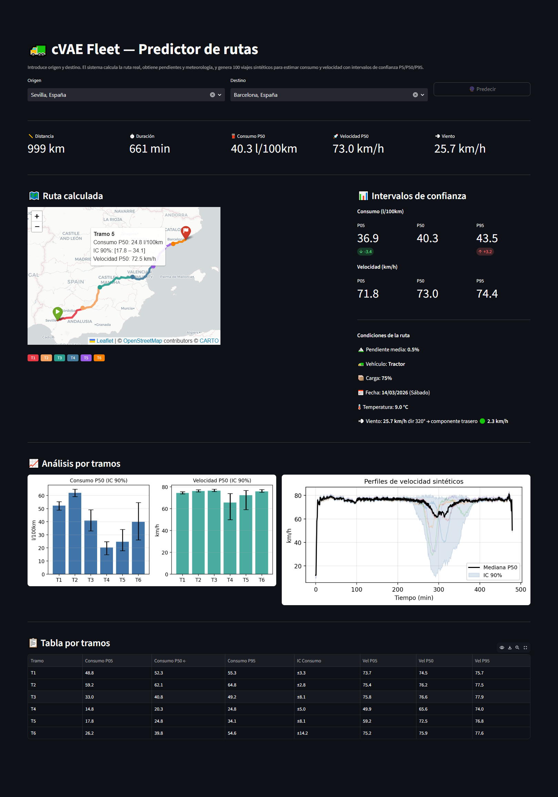

# 🚛 NSFfleet — Route Fuel Predictor for Heavy Transport

> **Given an origin and destination, predict fuel consumption and speed with confidence intervals — using real road data, live weather, and a Conditional Neural Spline Flow.**



---

## The Problem

Fleet managers in road freight have no reliable way to estimate fuel consumption before a trip. Static averages ignore terrain, load, weather and driving style. The result: poor planning, budget overruns, and no way to detect anomalous drivers.

**NSFfleet solves this by generating probabilistic forecasts** — not a single number, but a P5/P50/P95 range that tells you the realistic best case, expected case, and worst case for any route.

---

## How It Works

```
Origin + Destination
        ↓
  Real route (OSRM)
        ↓
  Elevation profile (Open-Topo-Data)  +  Live weather + wind direction (Open-Meteo)
        ↓
  ConditionalFlowModel (Neural Spline Flow) samples N synthetic trips
  across 10 randomised driving styles
        ↓
  P5 / P50 / P95 confidence intervals — per segment
```

The model was trained on **4,000 synthetic trips** generated with real heavy vehicle physics (aerodynamics, rolling resistance, grade force, BSFC map, 12-speed gearbox, engine thermal model). All APIs are free with no API key required.

The system also supports fine-tuning on **real fleet CANbus data** via `--mode real`.

---

## Results

| Route | Distance | Load | Consumption P50 | IC 90% |
|-------|----------|------|-----------------|--------|
| Sevilla → Barcelona | 999 km | 75% | 40.3 l/100km | ±3.4 |
| Madrid → Zaragoza | 325 km | 75% | 40.8 l/100km | ±3.2 |
| Madrid → Burgos | 240 km | 80% | 48.7 l/100km | ±2.9 |
| Barcelona → Valencia | 350 km | 60% | 43.7 l/100km | ±3.3 |

**Validation: 11/11 physical checks passed**

```
✅ Full load consumes more than empty     (+15.8 l/100km)
✅ Mountain consumes more than flat       (+83.6 l/100km)
✅ Temperature affects consumption        (+1.1 l/100km)
✅ Downhill consumes less than flat       (5.5 vs 30.6)
✅ Confidence intervals are useful        (IC > 1.5 l/100km in all scenarios)
✅ Realistic absolute values              (30.6 l/100km on flat, 0% slope)
```

---

## Key Technical Decisions

**Why a Neural Spline Flow instead of a cVAE?**

The original architecture was a Conditional VAE. VAEs approximate the posterior via the ELBO — which introduces reconstruction error, requires careful KL annealing schedules to avoid posterior collapse, and produces confidence intervals indirectly by averaging imperfect reconstructions.

`ConditionalFlowModel` (implemented with the [`nflows`](https://github.com/bayesiains/nflows) library) replaces this with a **normalizing flow using rational-quadratic spline transforms**. Concretely:

- **Exact log-likelihood** — the training objective is direct NLL minimisation, not an evidence lower bound. The model knows precisely how likely each trip is under the learned distribution.
- **No KL annealing** — the warmup schedule is gone. The training loop is simpler and more stable.
- **Sharper confidence intervals** — P5/P50/P95 come directly from sampling the learned density, not from averaging decoder outputs.
- **Same conditioning interface** — the route vector (elevation, weather, load, vehicle type, day of week, wind frontal component) is passed to the coupling network exactly as before.

The training history now tracks both `train_nll` / `val_nll` (flow objective) and `train_recon` / `val_recon` (reconstruction quality). The best checkpoint is selected by `best_val_nll`.

**Why model driving style diversity at inference time?**

A single conditioning vector produces samples from one implicit driver profile. At inference, `FleetPredictor` draws 10 driving styles uniformly from `[0, 1]` and generates `n_samples / 10` trips per style, then concatenates them. This means the P5/P95 interval reflects genuine inter-driver variability, not just model uncertainty — which is what fleet managers actually need.

**Why synthetic physics instead of real data first?**

Real fleet data is scarce, proprietary, and noisy. Training on physics-based synthetic data first gives the model a solid prior — it already understands that uphill burns more than downhill before seeing a single real trip. Fine-tuning on real data afterwards (via `--mode real`) is then much more sample-efficient.

**Why model wind direction and not just wind speed?**

A 25 km/h crosswind has almost zero aerodynamic penalty. The same wind head-on increases drag by ~12%. Both `app.py` and `main.py` compute the frontal wind component using `cos(bearing_diff)` between wind direction and route heading, and pass it as a conditioning feature to the flow.

---

## Quick Start

```bash
# Install dependencies
pip install -r requirements.txt

# Train on synthetic data (CPU, ~2h)
python main.py

# Train on real fleet data (CSV or Parquet)
python main.py --mode real --data data/mis_viajes.parquet

# Regenerate output charts without retraining
.\quick_viz.ps1          # Windows PowerShell
# python quick_viz_tmp.py  # or directly via Python

# Validate physics
python validate.py

# Launch the app
streamlit run app.py
```

---

## Project Structure

```
NSFfleet/
├── app.py                      ← Streamlit UI (ConditionalFlowModel)
├── main.py                     ← Training pipeline (--mode synthetic | real)
├── validate.py                 ← Physical validation
├── requirements.txt            ← Includes nflows>=0.14
├── data/
│   ├── synthetic.py            ← Physics engine (aero, BSFC map, gearbox, thermal)
│   └── real_dataset.py         ← Real telemetry loader (CSV / Parquet)
├── model/
│   └── nflow_model.py          ← ConditionalFlowModel (Neural Spline Flow via nflows)
├── train/
│   └── trainer.py              ← Training loop — NLL optimisation
├── inference/
│   └── predictor.py            ← FleetPredictor — P5/P50/P95 with driving style diversity
├── route/
│   └── route_builder.py        ← Route → conditioning vector pipeline
├── anomaly/
│   └── filter.py               ← Isolation Forest anomaly detection
└── checkpoints/
    ├── best_model.pt           ← Best checkpoint (selected by val NLL)
    ├── scaler.json             ← Feature scaler for real data mode
    └── training_meta.json      ← Training run metadata (mode, epochs, best NLL)
```

---

## Supported Vehicles

| Type | Empty mass | Max payload | Engine | Top speed |
|------|-----------|-------------|--------|-----------|
| Tractor (Class 8) | 8,500 kg | 24,000 kg | 420 kW | 90 km/h |
| Rigid truck | 7,500 kg | 12,000 kg | 250 kW | 90 km/h |
| Tanker (ADR) | 9,500 kg | 21,000 kg | 400 kW | 85 km/h |

---

## Roadmap

- [ ] Fine-tuning on real fleet CANbus data (pipeline ready, needs labelled data)
- [ ] Rain effect on rolling resistance
- [ ] Cost estimation in euros
- [ ] Real-time anomaly alerts (actual trip vs P95 prediction)
- [ ] Snow / ice driving conditions

---

## Stack

Python 3.11 · PyTorch · nflows · Streamlit · OSRM · Open-Meteo · Open-Topo-Data · Folium · CPU only

---

## License

MIT